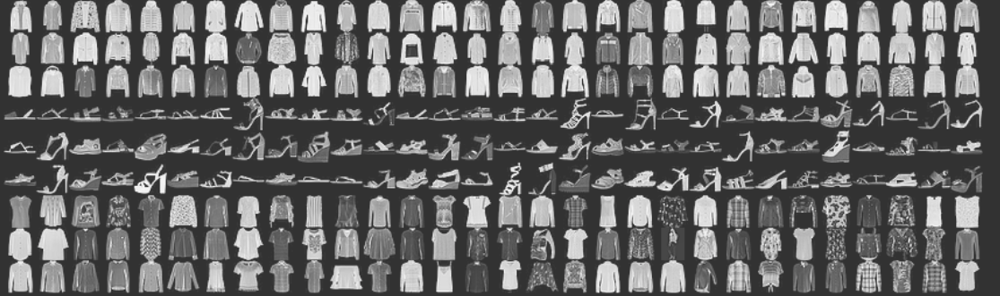

# Machine Learning Image Classification Model

## What are you wearing? 

Our team project is to create a [machine learning image classification model](https://www.analyticsvidhya.com/blog/2019/01/build-image-classification-model-10-minutes/) inspired by the [Fashion mnist dataset](https://www.tensorflow.org/tutorials/keras/classification). We're planning to train our model on articles of clothing e.g. t-shirt, sweater, pants, sneakers, etc.

## Description of data source ##

* Scraping and storing our own images for training, validation and testing goes beyond the time constraints of this project, so we are planning to use images from Google images.

## Expected data cleaning steps to make the data useful for machine learning
* To clean the images they will be formatted to the same size for training and testing.
* Planning to store the data in an AWS database.

## The machine learning models you plan on using ##
* [Convolutional neural network](https://en.wikipedia.org/wiki/Convolutional_neural_network)
* [Transfer learning](https://en.wikipedia.org/wiki/Transfer_learning)

## What metrics you plan on using to evaluate the ml model ##
* This is a [supervised learning](https://en.wikipedia.org/wiki/Supervised_learning) model so after we train the model on a **training** dataset, we will evaluate the model's overall accuracy at predicting the target image class on **validation/test datasets**.

## Presentation
> How you plan on demonstrating your model (web app, jupyter notebook)
* We're planning to set up a website where visitors can upload an image and have our classification model tell them what article of clothing the uploaded image is. We will also display our model's confidence in its prediction.

## Model training
> How do you plan on training the model (colab, personal computer, aws, Databricks)
* We plan on training the model using PySpark on Databricks using a compute cluster.

## Team Members ##
* Thuria Abdelaziz [@tkabdelaziz](https://github.com/tkabdelaziz/)
* Manmita Chakraborty [@manmita7](https://github.com/Manmita7)
* Dundar Karabay [@dundarkarabay](https://github.com/dundarkarabay)
* Jadd Cheng [@jlcatx512](https://github.com/jlcatx512/)

## References ##
* [ML Practicum: Image Classification](https://developers.google.com/machine-learning/practica/image-classification)
> Learn how Google developed the state-of-the-art image classification model powering search in Google Photos. Get a crash course on convolutional neural networks, and then build your own image classifier to distinguish cat photos from dog photos.
